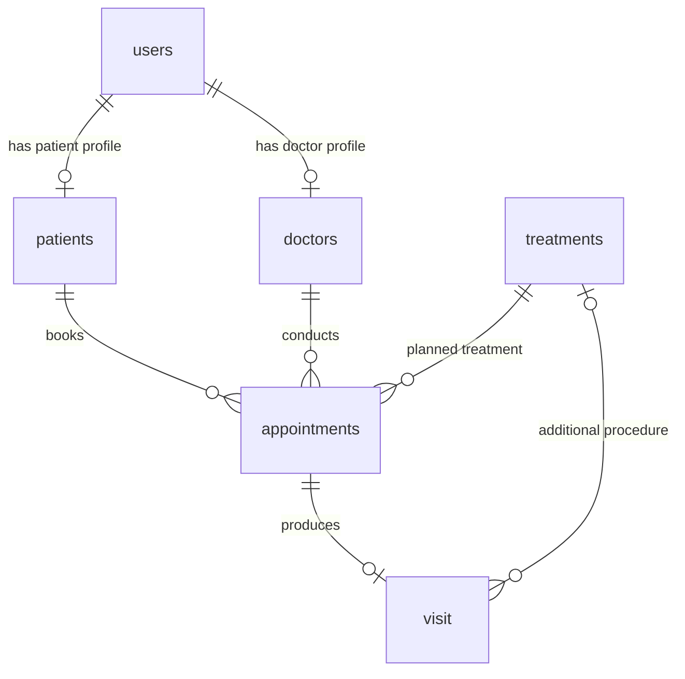

# Dental Clinic CRM — Logical Database Schema

## Purpose

This logical schema was designed for an MVP dental clinic CRM. It supports user and role management, patient and doctor profiles, appointment scheduling, a treatment catalogue, clinical visit records, and visit revenue.

The document describes the business structure of the data. It is not a production SQL migration.

## Entity-Relationship Diagram



## Key Business Rules

- `users` stores common account data; `patients` and `doctors` extend a user with role-specific profile data.
- Each patient or doctor profile belongs to exactly one user.
- Each appointment belongs to one patient and one doctor and contains one planned main treatment.
- Appointment duration is stored in minutes and defaults to 30 minutes.
- Appointment status is one of `scheduled`, `confirmed`, `cancelled`, `completed`, or `no_show`.
- A completed appointment may have one corresponding record in `visit`.
- A visit may contain up to two optional additional procedures.
- `visit.amount` stores the final amount for a completed visit.

## DBML Schema

The code can be copied into [dbdiagram.io](https://dbdiagram.io/) to render or edit the diagram.

```dbml
Table users {
  id int [pk, increment] // Auto-generated unique user ID
  role varchar(20) [not null] // superadmin, admin, doctor, patient
  first_name varchar(50) [not null]
  last_name varchar(50) [not null]
  phone_number varchar(20) [unique] // Format: +380XXXXXXXXX
  email varchar(50) [unique]
  password_hash varchar(255) // Encrypted password, never plain text
  registration_date timestamp [not null] // Date and time the user was created
  is_active bool
}

Table patients {
  id int [pk, increment] // Auto-generated unique patient ID
  user_id int [unique, not null, ref: - users.id] // One-to-one user profile extension
  gender varchar(20) // female, male, child, unknown
  date_of_birth date
  city varchar(100)
  address varchar(255) // Street address
  source varchar(30) // Patient acquisition source
  // organic_search — unpaid search result
  // paid_search — paid search advertisement
  // organic_social — unpaid social media content
  // paid_social — paid social media advertisement
  // referral — recommendation from another person or doctor
  // direct — direct website visit or existing awareness
  // offline_ad — sign, banner, billboard, or leaflet
  // other — known source outside the defined list
  // unknown — source could not be identified
}

Table doctors {
  id int [pk, increment] // Auto-generated unique doctor ID
  user_id int [unique, not null, ref: - users.id] // One-to-one user profile extension
  specialization varchar(100) [not null]
  // General Dentistry
  // Restorative Dentistry
  // Periodontics
  // Cosmetic Dentistry
  // Orthodontics
  // Pediatric Dentistry
  // Oral Surgery
  years_experience int // Full years of professional experience
  employment_type varchar(10) // full-time, part-time
}

Table treatments {
  id int [pk, increment] // Unique treatment ID
  treatment varchar(100) [not null, unique] // Treatment name shown in the clinic price list
  price decimal(10,2) [not null] // Standard treatment price
  is_main boolean [not null, default: true]
  // true — main planned treatment
  // false — additional procedure performed during a visit

  // Main treatments — is_main = true
  // dental_exam — Dental Examination — 600
  // consultation — Specialist Consultation — 800
  // cleaning — Professional Cleaning — 1,700
  // fluoridation — Fluoride Treatment — 1,200
  // sealant — Fissure Sealing — 500
  // emergency_exam — Emergency Examination — 800
  // filling — Dental Filling — 1,800
  // root_canal — Root Canal Treatment — 3,500
  // extraction — Tooth Extraction — 1,500
  // follow_up — Follow-up Examination — 400
  // ortho_adjustment — Orthodontic Adjustment — 1,200
  // deep_cleaning — Periodontal Cleaning — 3,000
  // whitening — Teeth Whitening — 5,000
  // crown — Dental Crown — 8,000
  // implant — Dental Implant — 20,000

  // Additional procedures — is_main = false
  // xray — Dental X-ray — 300
  // intraoral_scan — Intraoral Scan — 1,000
  // anesthesia — Local Anesthesia — 350
  // rubber_dam — Rubber Dam Isolation — 400
  // temp_filling — Temporary Filling — 300
  // medication — Medication Dressing — 500
  // polishing — Tooth Polishing — 500
  // desensitizing — Sensitivity Treatment — 500
  // suturing — Suturing — 700
  // hemostasis — Bleeding Control — 400
}

Table appointments {
  id int [pk, increment] // Auto-generated unique appointment ID
  created_at timestamp [not null]
  patient_id int [not null, ref: > patients.id]
  doctor_id int [not null, ref: > doctors.id]
  treatment_id int [not null, ref: > treatments.id] // Planned main treatment
  date_time timestamp [not null]
  duration int [not null, default: 30] // Duration in minutes
  status varchar(30) [not null, default: 'scheduled']
  // scheduled — created but not yet confirmed
  // confirmed — confirmed by the patient
  // cancelled — cancelled before the visit
  // completed — visit took place and was completed
  // no_show — patient did not attend
  notes varchar(250) // Optional administrative notes
}

Table visits {
  id int [pk, increment] // Auto-generated unique visit ID
  appointment_id int [not null, unique, ref: - appointments.id]
  treatment_add1 int [ref: > treatments.id] // First optional additional procedure
  treatment_add2 int [ref: > treatments.id] // Second optional additional procedure
  diagnosis text
  description text // Doctor's notes and treatment details
  recommendation text
  amount decimal(10,2) [not null] // Final amount for the completed visit
}
```